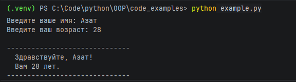

# Отчёт: Python — ввод и вывод на русском языке

## Код программы

Файл [`example.py`](example.py):

```python
name = input("Введите ваше имя: ")
age = int(input("Введите ваш возраст: "))

if age % 100 in range(11, 20):
    слово = "лет"
elif age % 10 == 1:
    слово = "год"
elif age % 10 in (2, 3, 4):
    слово = "года"
else:
    слово = "лет"

print()
print("-" * 30)
print(f"  Здравствуйте, {name}!")
print(f"  Вам {age} {слово}.")
print("-" * 30)
```

---

## Запуск из командной строки

```bash
python example.py
```

---

## Вывод программы


---

## Итог
Программа корректно принимает ввод с клавиатуры и выводит текст на русском языке.